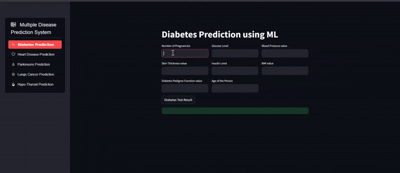

# Smart Predictive Modelling for Healthcare 🏥💡

**Smart Predictive Modelling for Healthcare** is designed to enhance patient outcomes by predicting critical health conditions—such as lung cancer, heart disease, Parkinson's, thyroid disorders, and diabetes—using advanced machine learning techniques. By identifying risks early, healthcare providers can intervene sooner, ultimately reducing costs and improving quality of care.

## Demo

Check out the demo of the meeting scheduler in action:



---

## Table of Contents 📖
1. [Overview](#overview)
2. [Project Objectives](#project-objectives)
3. [Key Tasks](#key-tasks)
   - [Data Preprocessing](#data-preprocessing)
   - [Model Development](#model-development)
4. [Repository Structure](#repository-structure)
5. [Installation](#installation)
6. [Usage](#usage)
7. [Contributing](#contributing)
8. [License](#license)
9. [Contact](#contact)

---

## Overview

The **Smart Predictive Modelling for Healthcare** project leverages machine learning to forecast several critical diseases, enabling proactive measures for better patient outcomes. By integrating robust **data preprocessing** methods and cutting-edge **algorithm implementations**, this system ensures reliable and accurate predictions.

---

## Project Objectives 🎯

- **Early Prediction**  
  Detect lung cancer, heart disease, Parkinson's, thyroid disorders, and diabetes at their earliest stages.
  
- **Data Preprocessing**  
  Ensure high-quality input data through thorough cleaning, normalization, and feature selection.

- **Algorithm Implementation**  
  Deploy advanced ML algorithms (Decision Trees, Random Forests, Logistic Regression) to maximize prediction accuracy.

---

## Key Tasks 🏗️

### Data Preprocessing
- **Feature Scaling**  
  Normalize data to maintain consistent feature scales across the dataset.
- **Feature Selection**  
  Identify and retain only the most relevant features, reducing overfitting and improving performance.

### Model Development
- **Decision Trees**  
  Easy-to-interpret models for quick insights and straightforward decision rules.
- **Random Forests**  
  Ensemble approach for robust, high-accuracy predictions capable of handling large datasets.
- **Logistic Regression**  
  Ideal for binary classification tasks (e.g., disease vs. no disease).

---

## Repository Structure 📂

```
smart-predictive-modelling-healthcare/
├── **Datasets/**  
│   └── Contains the datasets used for training and testing the models  
├── **Models/**  
│   └── Saved models and related files  
├── **Heart_Disease_Prediction.ipynb**  
├── **Lung_Cancer.ipynb**  
├── **Multiple_Disease_Pred.py**  
├── **Parkinson's_Disease_Detection.ipynb**  
├── **Thyroid.ipynb**  
├── **requirements.txt**  
└── **LICENSE**  
```

- **Datasets/**: Contains data for all disease predictions.  
- **Models/**: Stores trained models for quick deployment or further analysis.  
- **Heart_Disease_Prediction.ipynb**: Notebook detailing heart disease ML workflows.  
- **Lung_Cancer.ipynb**: Notebook for lung cancer analysis and model implementation.  
- **Multiple_Disease_Pred.py**: Python script to integrate multiple disease predictions.  
- **Parkinson's_Disease_Detection.ipynb**: Focuses on Parkinson's disease detection.  
- **Thyroid.ipynb**: Dedicated to thyroid disorder predictions.  
- **requirements.txt**: Lists necessary Python dependencies.

---

## Installation ⚙️

1. **Clone the Repository**  
   ``` 
   git clone https://github.com/Ria2810/smart-predictive-modelling-healthcare.git  
   ```

2. **Navigate to the Project Directory**  
   ```  
   cd smart-predictive-modelling-healthcare  
   ```

3. **Install Dependencies**  
   ```  
   pip install -r requirements.txt  
   ```

---

## Usage 🚀

1. **Load Datasets**  
   Place all relevant datasets in the **Datasets/** directory.

2. **Run Jupyter Notebooks**  
   Execute each notebook (`*.ipynb`) in your Jupyter environment to view results and analyses.  
   ```  
   jupyter notebook  
   ```

3. **Execute Python Script**  
   Use the `Multiple_Disease_Pred.py` script to get predictions for multiple diseases.  
   ```  
   python Multiple_Disease_Pred.py  
   ```

---

## Contributing 🤝

Contributions are welcomed! To contribute:

1. **Fork the Repository**  
2. **Create a New Branch**  
   ```  
   git checkout -b feature-branch  
   ```
3. **Make Changes**  
4. **Commit Changes**  
   ```  
   git commit -am "Add new feature or fix"  
   ```
5. **Push to Your Branch**  
   ```  
   git push origin feature-branch  
   ```
6. **Open a Pull Request**  

We appreciate your ideas and improvements!

---

## License 📄

This project is licensed under the **MIT License**. See the [LICENSE](./LICENSE) file for details.

---

## Contact 📬

For any questions or feedback, please reach out via:

- **Email**: [riachoudhari9@gmail.com](mailto:riachoudhari9@gmail.com)  
- **LinkedIn**: [Ria Choudhari](https://www.linkedin.com/in/ria-choudhari-a681b5200/)

---

> *"The greatest wealth is health." – Virgil*  
Harness the power of predictive modelling to revolutionize healthcare and save lives.
